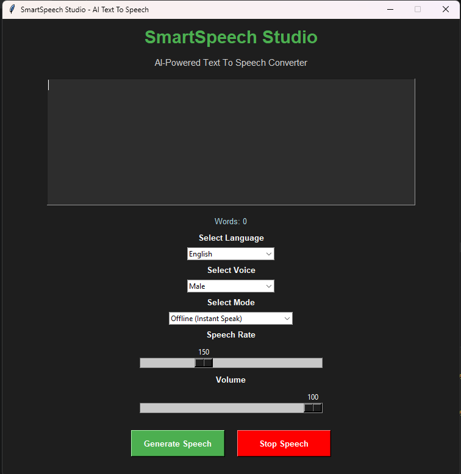

# SmartSpeech Studio 🎙️

An AI-Powered Text-to-Speech Desktop Application built using Python and Tkinter.

## 🚀 Features

- Offline Text-to-Speech
- AI Voice MP3 Export
- Multi-language Support
- Male/Female Voice Selection
- PDF to Speech Conversion
- TXT File to Speech
- Play Saved Audio
- Stop Speech Feature
- Adjustable Speech Rate
- Volume Control
- Modern Dark UI
- Word Counter
- MP3 Audio Export

---

## 🖥️ Application Preview



---

## 🛠️ Technologies Used

- Python
- Tkinter
- pyttsx3
- gTTS
- pygame
- PyPDF2

---

## 📦 Installation

### Step 1: Clone Repository

```bash
git clone https://github.com/YOUR_USERNAME/SmartSpeech-Studio.git
```

### Step 2: Move Into Folder

```bash
cd SmartSpeech-Studio
```

### Step 3: Install Dependencies

```bash
pip install -r requirements.txt
```

### Step 4: Run Application

```bash
python main.py
```

---

## 📂 Project Structure

```text
SmartSpeech-Studio/
│
├── main.py
├── requirements.txt
├── README.md
├── LICENSE
├── .gitignore
├── screenshots/
└── assets/
```

---

## 🌍 Supported Languages

- English
- Hindi
- French
- Spanish
- German
- Italian

---

## ✨ Future Enhancements

- Speech Recognition
- Voice Cloning
- AI Chatbot Integration
- Custom Themes
- Cloud Storage Support

---

## 👨‍💻 Author

Sankar Sahoo

---

## 📜 License

This project is licensed under the MIT License.